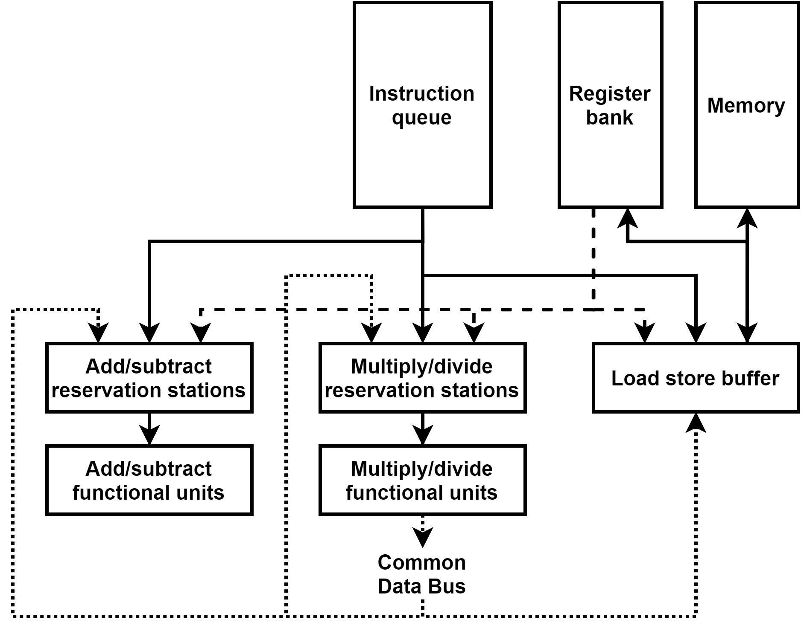

# Tomasulo

Simulador do algoritmo de Tomasulo - superescalaridade

**Para executar:**

> g++ tomasulo.cpp -o tomasulo
>
> tomasulo
>
> instructions.txt

_Os registradores foram inicializados com um valor de 10._

No exemplo a seguir:

ADD F1, F2, F3 # F1 = F2 + F3

SUB F4, F1, F5 # F4 = F1 - F5

MUL F6, F4, F1 # F6 = F4 \* F1

Os valores finais são:

F1 = 20

F4 = 10

F6 = 200

O restante será 10, pois foram inicializados com esse valores.
